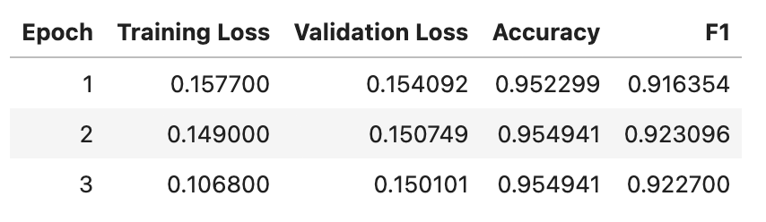

# Fast Classifiers for Prompt Routing
Routing and controlling the information flow is a core component in optimizing machine learning tasks.  While some architectures focus on internal routing of data within a model, we focus on the external routing of data between models.  This enables the combination of open source, proprietary, API based, and software based approaches to work together behind a smart router.   We investigate three different ways of externally routing the prompt - cosine similarity via embeddings, zero-shot classification, and small classifiers. 

# Implementation of Fast Classifiers
The code-class.ipynb jupyter notebook walks through the process of creating a fast prompt classifier for smart routing.  For the fast classifiers, we utilize the model [DistilBERT](https://huggingface.co/docs/transformers/en/model_doc/distilbert), a smaller language representation model designed for efficient on-the-edge operation and training under computational constraints. DistilBERT is not only less costly to pre-train but also well-suited for on-device computations, as demonstrated through experiments and comparative studies.

We quantize the model using [Optimum](https://huggingface.co/docs/optimum/index), enabling the model to run extremely fast on a CPU router.  Each classifier takes 5-8ms to run.  An ensemble of 8 prompt classifiers takes about 50ms in total.  Thus, each endpoint can route about 20 requests per second.

In the example code-class, we are deciding between prompts of code and not code prompts.  The two datasets used are the 52K [instruction-following data](https://arxiv.org/abs/2304.03277) generated by GPT-4 with prompts in Alpaca. And the  20K instruction-following data used for fine-tuning the [Code Alpaca](https://github.com/sahil280114/codealpaca) model. 

Train test split of 80/20 yields an accuracy of 95.49% and f1 score of 0.9227.

# Comparison vs other Routing methods
The most popular alternative to routing is via embedding simlarity.  For example, if one were to try to route a programming question, one might set up the set of target classes as ["coding", "not coding"].  Each one of these strings is then transformed into an embedding and compared against a prompt query like, "write a bubble sort in python".  Given the computed pair-wise cosine similarity between the query and class, we can then label the prompt as a coding question and route the prompt to a coding-specific model.  These do not scale well with larger numbers of embeddings.  Nor are they able to capture non-semantic type classes (like is the response likely to be more or less than 200 tokens).  However, they are adapable and comparably fast and thus provide a good alternative to the trained fast classifiers.  

Quantifying different methods of routing in terms of execution time.  As the prompt size increases, the query time also increases as shown in (a).  There is also a close to linear increase in the time as the number of classes increase as shown in (b).  However, the small classifiers do not increase in time as the class examples increase in the number of tokens (c).  This is due to the upfront cost of training the binary classifier, reducing cost at inference.

# Reproducability
The timing_tests.js and complexity.js files can be used for reproducability.  Note that only the code classifier is currently available in this repo.  One will need to install the appropriate models from the [Transformers.js](https://huggingface.co/docs/transformers.js/en/index) repo.

